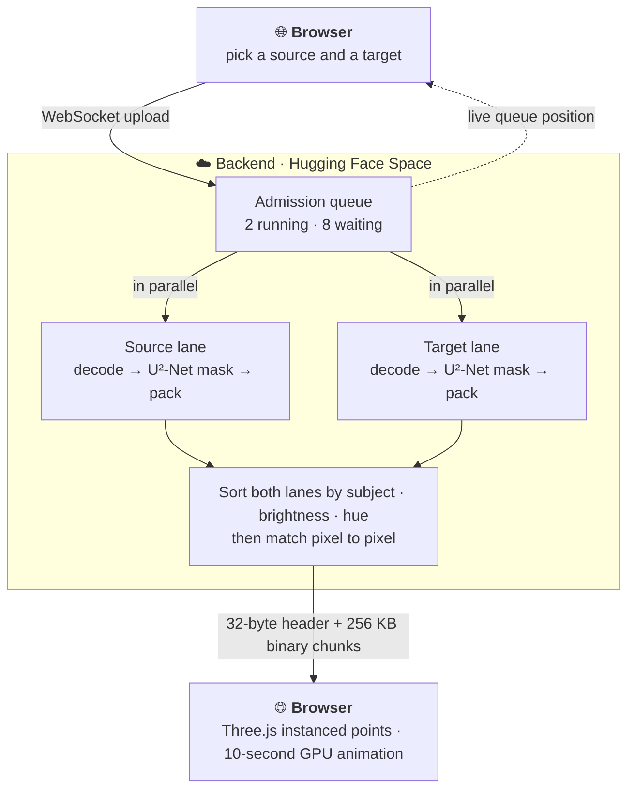
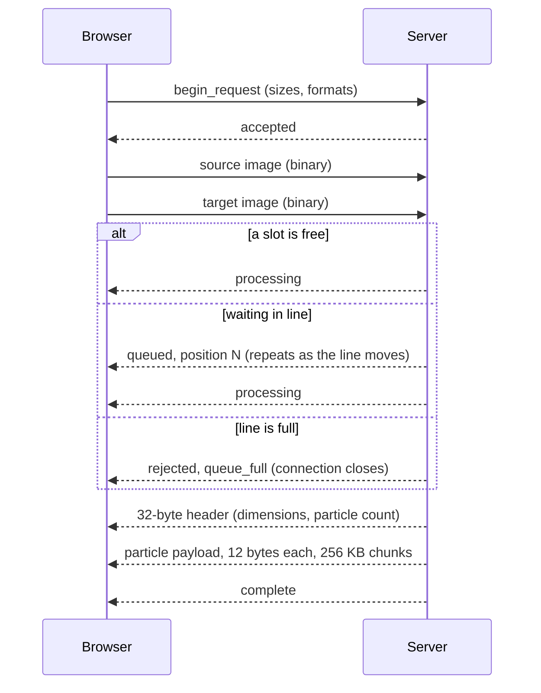

<p align="center">
  
</p>

<h1 align="center">Pixel Mosaic</h1>

<p align="center">
  <strong>Rebuild any image out of another image's pixels</strong> — streamed to your browser
  as a live WebGL particle storm.
</p>

<p align="center">
  <a href="https://mrtechdynamo23.github.io/Morphosaic/">
    
  </a>
</p>

<p align="center">
  
  
  
  
  <a href="https://huggingface.co/spaces/shreyasvn/pixel-mosaic"></a>
  <a href="LICENSE"></a>
</p>

---

Pick two photos: a **source** and a **target**. Pixel Mosaic finds the subject of each with an
AI saliency model, then rebuilds the target using only pixels taken from the source. Foreground
pixels go to the foreground and background to background, matched by brightness and hue. You
then watch a ten-second animation of every pixel flying into its new place.

No sign-up and nothing to install. Open the page and pick two images.

## ✨ Features

- **GPU particle animation.** Three.js instanced points with custom shaders move every pixel at
  once. The source holds for a beat, then flies into the target's shape.
- **AI subject extraction.** A [U²-Net](https://github.com/xuebinqin/U-2-Net) saliency model on
  ONNX Runtime separates subject from background in both images.
- **Binary streaming protocol.** Over a WebSocket the server sends a 32-byte header, then
  12 bytes per particle in 256 KB chunks.
- **Fair under load.** Two mosaics are built at a time. Everyone else waits in a first-come,
  first-served queue and sees their live position. Sending finished results never holds up
  processing.
- **Hardened for the public internet.** Oversized and decompression-bomb images are rejected
  before decoding, and each IP is rate-limited.
- **Download your mosaic** as a PNG when the animation finishes.

## 🎬 How it works



Each pixel is packed into a single 64-bit key: subject/background bit, brightness, hue, then
x and y. Sorting the keys lines up source and target pixels that belong together, so subject
pixels fill the target's subject and background pixels fill its background.

<details>
<summary>Wire protocol</summary>


</details>

For the full design (memory budgets, wire protocol, concurrency model and pipeline stages), see
**[ARCHITECTURE.md](ARCHITECTURE.md)**.

## 📏 Limits

| | |
| --- | --- |
| Formats | JPEG, PNG, WebP |
| File size | up to 10 MB per image |
| Resolution | up to 100 MP; anything over 2 MP is scaled down for processing |
| Usage | 30 mosaics per hour per IP |

The backend runs on a free Hugging Face Space. If it has been idle, the first request can take
up to a minute while it starts.

## 🧱 Tech stack

| Layer | Technology |
| --- | --- |
| Frontend | Three.js (WebGL), vanilla JS, GitHub Pages |
| Backend | Java 21, Spring Boot 3.2, WebSocket streaming |
| AI | U²-Net saliency model on ONNX Runtime |
| Imaging | TwelveMonkeys + JAI ImageIO (JPEG / PNG / WebP) |
| Infra | Docker, Hugging Face Spaces, GitHub Actions, Caffeine |

## 🐳 Run it yourself

**1. Start the backend.** Use the published image:

```bash
docker run --rm -p 8080:7860 ghcr.io/shreyasnandurkar/pixel-mosaic:latest
```

or build it from source:

```bash
docker build -t pixel-mosaic .
docker run --rm -p 8080:7860 pixel-mosaic
```

**2. Serve the frontend** from `localhost`. It connects to the backend on `localhost:8080`
automatically.

```bash
python -m http.server 5500 -d frontend
```

Then open <http://localhost:5500>. Opening `index.html` directly from disk won't work, because
browsers block ES module imports from `file://`.

<details>
<summary>Prefer plain Maven?</summary>

```bash
mvn spring-boot:run        # backend on http://localhost:8080
```

Requires JDK 21. The U²-Net model ships with the repo (`src/main/resources/models/`).
</details>

<details>
<summary>Configuration</summary>

Set these in `src/main/resources/application.yml` or as environment variables.

| Setting | Default | Meaning |
| --- | --- | --- |
| `pixelmosaic.max-concurrent` | `2` | mosaics processed at once |
| `pixelmosaic.max-queued` | `8` | requests that can wait in line; more are turned away |
| `pixelmosaic.rate-limit-per-hour` | `30` | requests per IP per hour |
| `pixelmosaic.trusted-proxy-hops` | `0` | proxies in front of the app that append to `X-Forwarded-For` |
| `ADMIN_TOKEN` | *(unset)* | enables `GET /admin/stats` (send it in the `X-Admin-Token` header) |
</details>

## 📁 Project layout

```
frontend/                     static WebGL client (GitHub Pages)
src/main/java/com/pixelmosaic/
  ├── ws/                     WebSocket handler + binary protocol
  ├── pipeline/               decode → mask → pack → sort/map
  ├── admission/              request queue + per-IP rate limiting
  ├── stats/                  usage counter
  ├── web/                    health and admin endpoints
  └── config/                 ONNX session, executors, buffer pool
.github/workflows/            Pages deploy, Docker publish, keep-awake ping
Dockerfile                    backend image (Hugging Face Space)
ARCHITECTURE.md               full technical design
```

## 📄 License

Released under the [MIT License](LICENSE) © 2026 Sudharrshan.

<p align="center"><sub>Made with ♥ — every pixel counts.</sub></p>
